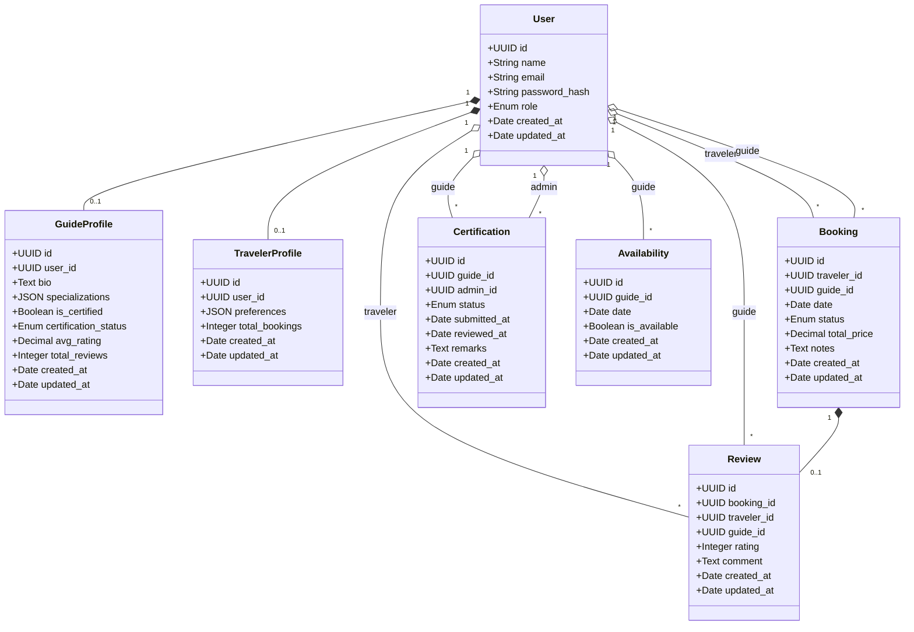

# Class Diagram
This diagram represents the Object-Oriented structure of the application's models.

```mermaid
classDiagram
    class User {
        +UUID id
        +String name
        +String email
        +String password_hash
        +Enum role
        +Date created_at
        +Date updated_at
    }
    class GuideProfile {
        +UUID id
        +UUID user_id
        +Text bio
        +JSON specializations
        +Boolean is_certified
        +Enum certification_status
        +Decimal avg_rating
        +Integer total_reviews
        +Date created_at
        +Date updated_at
    }
    class TravelerProfile {
        +UUID id
        +UUID user_id
        +JSON preferences
        +Integer total_bookings
        +Date created_at
        +Date updated_at
    }
    class Booking {
        +UUID id
        +UUID traveler_id
        +UUID guide_id
        +Date date
        +Enum status
        +Decimal total_price
        +Text notes
        +Date created_at
        +Date updated_at
    }
    class Certification {
        +UUID id
        +UUID guide_id
        +UUID admin_id
        +Enum status
        +Date submitted_at
        +Date reviewed_at
        +Text remarks
        +Date created_at
        +Date updated_at
    }
    class Review {
        +UUID id
        +UUID booking_id
        +UUID traveler_id
        +UUID guide_id
        +Integer rating
        +Text comment
        +Date created_at
        +Date updated_at
    }
    class Availability {
        +UUID id
        +UUID guide_id
        +Date date
        +Boolean is_available
        +Date created_at
        +Date updated_at
    }

    User "1" *-- "0..1" GuideProfile
    User "1" *-- "0..1" TravelerProfile
    User "1" o-- "*" Booking : traveler
    User "1" o-- "*" Booking : guide
    User "1" o-- "*" Certification : guide
    User "1" o-- "*" Certification : admin
    User "1" o-- "*" Review : traveler
    User "1" o-- "*" Review : guide
    User "1" o-- "*" Availability : guide
    Booking "1" *-- "0..1" Review
```
