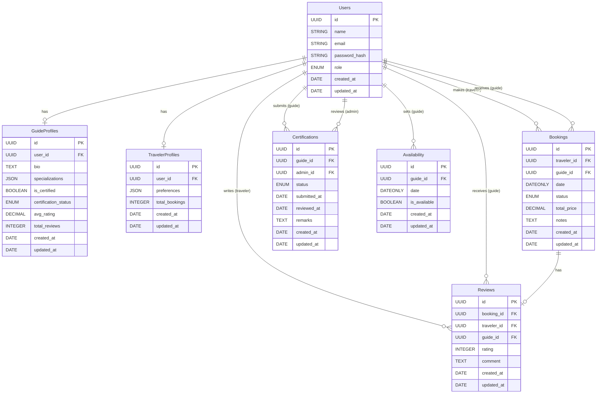

# Entity-Relationship (ER) Diagram
This diagram represents the relational structure of the database tables based on the Sequelize models.

```mermaid
erDiagram
    Users {
        UUID id PK
        STRING name
        STRING email
        STRING password_hash
        ENUM role
        DATE created_at
        DATE updated_at
    }
    GuideProfiles {
        UUID id PK
        UUID user_id FK
        TEXT bio
        JSON specializations
        BOOLEAN is_certified
        ENUM certification_status
        DECIMAL avg_rating
        INTEGER total_reviews
        DATE created_at
        DATE updated_at
    }
    TravelerProfiles {
        UUID id PK
        UUID user_id FK
        JSON preferences
        INTEGER total_bookings
        DATE created_at
        DATE updated_at
    }
    Bookings {
        UUID id PK
        UUID traveler_id FK
        UUID guide_id FK
        DATEONLY date
        ENUM status
        DECIMAL total_price
        TEXT notes
        DATE created_at
        DATE updated_at
    }
    Certifications {
        UUID id PK
        UUID guide_id FK
        UUID admin_id FK
        ENUM status
        DATE submitted_at
        DATE reviewed_at
        TEXT remarks
        DATE created_at
        DATE updated_at
    }
    Reviews {
        UUID id PK
        UUID booking_id FK
        UUID traveler_id FK
        UUID guide_id FK
        INTEGER rating
        TEXT comment
        DATE created_at
        DATE updated_at
    }
    Availability {
        UUID id PK
        UUID guide_id FK
        DATEONLY date
        BOOLEAN is_available
        DATE created_at
        DATE updated_at
    }

    Users ||--o| GuideProfiles : "has"
    Users ||--o| TravelerProfiles : "has"
    Users ||--o{ Bookings : "makes (traveler)"
    Users ||--o{ Bookings : "receives (guide)"
    Users ||--o{ Certifications : "submits (guide)"
    Users ||--o{ Certifications : "reviews (admin)"
    Users ||--o{ Reviews : "writes (traveler)"
    Users ||--o{ Reviews : "receives (guide)"
    Users ||--o{ Availability : "sets (guide)"
    Bookings ||--o| Reviews : "has"
```
